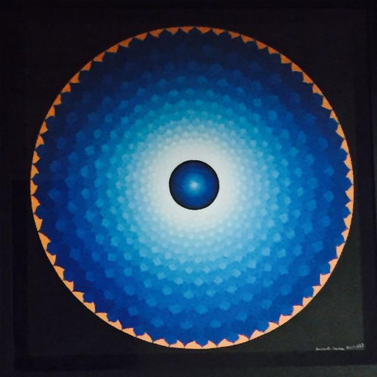

# cyclical

1) Inspiration
I've always liked looking at geometric patterns and love to explore them in my own personal artwork. I also like to take inspiration from mandalas and other geometry-based patterns a lot of the time, so for this assignment, I wanted to see if there was a way I could somehow animate something like a mandala. One of the main sources of inspiration was this huge painting my mum has up in our home. I spend a lot of the time staring at it or walking by it and I thought it would be cool to see if I could maybe use it as a reference to create a moving, geometric pattern. Below is a picture of the painting. 

2) Sources & Process
I wanted to just try out a new skill on openframeworks. Since I am still not super familiar with it and really am a beginner in all of this, I thought this sketch would be a fun way I could figure out some new stuff and possibily use it in my next assignment or even my final product. 
- I intended for the animation to have one shape (i.e. square) repeated and rotating to form a cool, star like pattern. 
- I also wanted it to change in color in some way (eg. fading from color to color)
I took inspiration from the code in class (https://github.com/NYUAD-IM/Software-Art-Image/tree/main/code/simpletimeline) in order to change the color over time.
I also looked on youtube and found a video (https://youtu.be/5WoG8-yHnw8) which I thought was a really cool and simple way to create geometric animations. It uses the running application's time as the driver to rotate the rectangles. The scale is set at (0.9) so it takes the intial width and height value and scales it down to 0.9, and so on, to create a bunch of rectangles. 
I played around with the timing until I was satisfied with it. Next, I added in the color. I chose for the colors to fade from blue to orange, mimicing the colors from the painting. After this, I decided to add circles to the loop, as I thought it made the animation look a lot more 'complete.'

3) Improvements?
I definitely feel like there's a lot of things I can work on here. If I were to continue down this road of geometric patterns/mandalas and whatnot, I would try and incorporate more shapes other than circles and rectangles. It would be interesting to see them animate in a different manner rather than just rotation (eg. scaling at different sizes, varying widths etc.) Maybe I could play around more with colors, since this one only entailed 2 main colors. Also, I wasn't sure how to make the colors keep fading in and out of blue - orange, so it would be cool to try that out too. 

4) My Result:
https://youtu.be/98As9VWe5yk
